# Sofascore ETL — обзор проекта

## Что это

Непрерывный мульти-спортивный ETL-конвейер, который вытягивает данные из Sofascore-style upstream API, нормализует их в PostgreSQL и отдаёт через локальный FastAPI совместимый с Sofascore контракт. Не однократный inspector — это постоянный runtime из планировщиков, Redis Stream-воркеров и нормализующего sink, плюс операционный API сверху.

Главная цель: иметь полный, регулярно обновляющийся локальный mirror Sofascore live + scheduled + finished событий с детализацией по статистике, lineups, инцидентам и т. д., — чтобы клиенты могли отдавать читать данные из своего бекенда вместо проксирования каждого запроса в Sofascore.

## High-level архитектура

```
                                 ┌──────────────────────────────────┐
                                 │   Sofascore upstream API          │
                                 │   (sofascore.com/api/v1/...)      │
                                 └────────────┬─────────────────────┘
                                              │ HTTPS через Smartproxy
                                              │ (curl_cffi chrome110)
                                              ▼
┌────────────────────┐    ┌────────────────────────────────────────────┐
│  Planners          │    │  Workers (Redis Stream consumers)          │
│  (cadence)         │───▶│                                            │
│  - planner-daemon  │    │  Discovery → Hydrate → Live tier 1/2/3 →   │
│  - live-discovery- │    │   Live details → Normalize                 │
│    planner-daemon  │    │                                            │
│  - historical-*    │    │  Historical lanes (lower priority):        │
│  - resource-       │    │   Historical discovery / hydrate /         │
│    planner-daemon  │    │   tournament / enrichment / maintenance    │
│  - structure-      │    │                                            │
│    planner-daemon  │    │  Plus: maintenance (reclaim/DLQ),          │
└────────────────────┘    │  structure-sync, resource-refresh          │
                          └────────────┬───────────────────────────────┘
                                       │ asyncpg pool
                                       ▼
                          ┌────────────────────────┐
                          │   PostgreSQL           │
                          │   (durable storage)    │
                          │  - raw snapshots       │
                          │  - normalized event    │
                          │    tables              │
                          │  - state / audit       │
                          └────────────┬───────────┘
                                       │
                                       ▼
                          ┌────────────────────────┐
                          │  Local FastAPI server  │
                          │  (sofascore-api)       │
                          │  port 8000             │
                          │  - /api/v1/...         │
                          │    (Sofascore-shape)   │
                          │  - /ops/...            │
                          │  - /openapi.json       │
                          │  - / Swagger UI        │
                          └────────────────────────┘
```

Redis выступает как координатор: streams для очередей задач, hash/zset/string keys для live-state, lease, freshness, throttle, dispatch metrics. Подробнее см. [REDIS_AND_QUEUES.md](REDIS_AND_QUEUES.md).

## Pipeline data flow (Mermaid)

```mermaid
flowchart TD
    subgraph Upstream["Sofascore upstream"]
        S[sofascore.com/api/v1/*]
    end

    subgraph Planners["Планировщики (cadence)"]
        P1[planner-daemon]
        P2[live-discovery-planner-daemon]
        P3[historical-planner-daemon]
        P4[historical-tournament-planner-daemon]
        P5[resource-planner-daemon]
        P6[structure-planner-daemon]
    end

    subgraph Streams["Redis Streams"]
        SD[stream:etl:discovery]
        SLD[stream:etl:live_discovery]
        SH[stream:etl:hydrate]
        ST1[stream:etl:live_tier_1]
        ST2[stream:etl:live_tier_2]
        ST3[stream:etl:live_tier_3]
        SLW[stream:etl:live_warm]
        SLH[stream:etl:live_hot]
        SLDET[stream:etl:live_details]
        SN[stream:etl:normalize]
        SRR[stream:etl:resource_refresh]
        SSS[stream:etl:structure_sync]
        SHD[stream:etl:historical_*]
        SDLQ[stream:etl:dlq]
    end

    subgraph Workers["Воркеры"]
        WD[discovery-worker]
        WLD[live-discovery-worker]
        WH[hydrate-worker]
        WLT[live-tier-1/2/3-worker]
        WLW[live-warm-worker]
        WLDET[live-details-worker]
        WN[normalize-worker]
        WRR[resource-refresh-worker]
        WSS[structure-sync-worker]
        WM[maintenance-worker]
    end

    subgraph DB["PostgreSQL"]
        APS[(api_payload_snapshot)]
        APL[(api_request_log)]
        EVT[(event + normalized)]
        ETS[(event_terminal_state)]
        ELSH[(event_live_state_history)]
        ECO[(endpoint_capability_observation)]
        ECR[(endpoint_capability_rollup)]
        EJR[(etl_job_run)]
    end

    subgraph API["Local FastAPI server"]
        APIS[uvicorn :8000]
        SWAG[Swagger UI /]
    end

    S -->|fetch via Smartproxy| WD
    S -->|fetch| WLD
    S -->|fetch| WH
    S -->|fetch| WLT
    S -->|fetch| WLW
    S -->|fetch| WLDET
    S -->|fetch| WRR
    S -->|fetch| WSS

    P1 -->|publish refresh_live_event| ST1
    P1 -->|publish refresh_live_event| ST2
    P1 -->|publish refresh_live_event| ST3
    P1 -->|publish refresh_live_event scope=warm| SLW
    P1 -->|publish discover_sport_surface| SD
    P2 -->|publish discover_sport_surface| SLD
    P3 -->|publish historical jobs| SHD
    P4 -->|publish tournament jobs| SHD
    P5 -->|publish refresh_resource| SRR
    P6 -->|publish structure jobs| SSS

    SD --> WD
    SLD --> WLD
    SH --> WH
    ST1 --> WLT
    ST2 --> WLT
    ST3 --> WLT
    SLW --> WLW
    SLH --> WLW
    SLDET --> WLDET
    SN --> WN
    SRR --> WRR
    SSS --> WSS
    SHD --> WH

    WD -->|publish hydrate jobs| SH
    WLD -->|publish hydrate jobs| SH
    WLT -->|optional fanout| SLDET

    WH --> APS
    WH --> EVT
    WH --> ETS
    WH --> ECO
    WLT --> APS
    WLT --> EVT
    WLT --> ELSH
    WLDET --> APS
    WLDET --> EVT
    WN --> EVT
    WRR --> APS

    WD --> EJR
    WH --> EJR
    WLT --> EJR
    WLDET --> EJR
    WN --> EJR

    WM -->|reclaim stale| SDLQ

    DB --> APIS
    APIS --> SWAG
```



## Внешние зависимости

| Зависимость | Назначение | Где конфигурируется |
|---|---|---|
| **Sofascore upstream** | Источник данных (HTTPS API) | `D:\sofascore\schema_inspector\endpoints.py` (path templates), `SOFASCORE_BASE_URL=https://www.sofascore.com` |
| **Smartproxy** | Резидентский прокси-провайдер для обхода Cloudflare, IP-ротация | `.env: SCHEMA_INSPECTOR_PROXY_URLS=...` (5 endpoints в проде) |
| **curl_cffi** | HTTP клиент с Chrome TLS fingerprint impersonation (chrome110) | `D:\sofascore\schema_inspector\runtime.py`, `transport.py` |
| **PostgreSQL 16** | Durable хранилище: snapshots, нормализованные таблицы, audit | `.env: SOFASCORE_DATABASE_URL=postgresql://...`, default localhost:5432 |
| **Redis** | Очереди задач (streams), live-state (zset/hash), dispatch metrics, lease/freshness keys | `.env: REDIS_URL=redis://...`, default 127.0.0.1:6379 |
| **FastAPI / uvicorn** | Локальный HTTP сервер для отдачи Sofascore-shape API | `sofascore-api.service`, port 8000 (см. `local_api_server.py`) |
| **asyncpg** | Async PostgreSQL driver (используется во всём ETL) | `D:\sofascore\schema_inspector\db.py:create_pool_with_fallback` |
| **systemd** | Process supervision на проде | `D:\sofascore\ops\systemd\*.service` |
| **orjson** | Fast JSON для payload (де)сериализации | global |

## Что НЕ делает проект

- **Не проксирует** запросы 1:1 — на хорошие ручки отвечает сам из локальной БД (raw snapshot или synthesizer).
- **Не хранит изображения** — `img.sofascore.com/...` URL строит фронтенд по entity id.
- **Не пишет в Sofascore** — read-only consumer.
- **Не обрабатывает платежи / пользователей** — это чистый data pipeline.

## Главные модули (high-level)

| Папка/файл | Роль |
|---|---|
| `D:\sofascore\schema_inspector\cli.py` | Единая точка входа: `python -m schema_inspector.cli <subcommand>` — все воркеры, планировщики, ad-hoc команды. |
| `D:\sofascore\schema_inspector\services\` | Планировщики, worker_runtime, backpressure, service_app (фабрика). |
| `D:\sofascore\schema_inspector\workers\` | Stream consumers: discovery, hydrate, live, normalize, maintenance, resource_refresh, historical. |
| `D:\sofascore\schema_inspector\pipeline\pilot_orchestrator.py` | Сердце hydration: вызывает policy/parser/repository в правильном порядке. |
| `D:\sofascore\schema_inspector\queue\` | Redis примитивы: streams, leases, freshness, dedupe, live_state, dispatch_metrics, proxy_state. |
| `D:\sofascore\schema_inspector\storage\` | asyncpg repositories: raw, normalize, capability, job, coverage, live_state, negative_cache, retention. |
| `D:\sofascore\schema_inspector\parsers\` | Парсеры payload по семействам/спортам/special. |
| `D:\sofascore\schema_inspector\endpoints.py` | Реестр всех Sofascore endpoint-templates (SofascoreEndpoint dataclass). |
| `D:\sofascore\schema_inspector\local_api_server.py` | FastAPI app, route dispatcher, response cache, OpenAPI serve. |
| `D:\sofascore\schema_inspector\local_swagger_builder.py` | Сборка OpenAPI 3.0 документа из endpoint registry. |
| `D:\sofascore\schema_inspector\match_center_policy.py` | Football gating: detail_id → tier, isEditor HARD BAN. |
| `D:\sofascore\schema_inspector\detail_resource_policy.py` | Какие endpoints доставать в каком hydration_mode. |
| `D:\sofascore\schema_inspector\live_dispatch_policy.py` | Маршрутизация event'а в tier_1/tier_2/tier_3 шард + lease lengths. |
| `D:\sofascore\schema_inspector\live_delta_policy.py` | Что обновлять в live_delta refresh polls (per-sport edges/endpoints). |
| `migrations/` | Datestamped SQL миграции (append-only). |
| `postgres_schema.sql` | Snapshot текущей схемы. |
| `ops/systemd/` | Production unit-файлы для всех сервисов/воркеров. |
| `deploy/run_service.sh` | Тонкий launcher: активирует venv и запускает `python -m schema_inspector.cli ...`. |

## Hydration режимы (краткая сводка)

| Mode | Что забирает | Кто использует |
|---|---|---|
| `full` | ROOT + все core edges (incidents/lineups/stats/graph/comments) + все detail endpoints + per-player followups | Один-shot CLI `event`, planner для **scheduled** + finished events |
| `core` | ROOT + 5 core edges; без details, без per-player | Лёгкая первичная hydration |
| `live_delta` | ROOT + sport-specific edges; для football — fall-through на full detail spec (X4); per-player заблокирован (`lightweight_only=True`) | Live tier-1/2/3 polling |
| `root_only` | Только ROOT; если статус terminal — финализирует, иначе ставит флаг edges_pending=True для отложенного догрева | P0.b tier_1 fast-path |

Подробности — [PARSING_AND_POLICIES.md](PARSING_AND_POLICIES.md).

## Tier-классификация (футбол)

Football events маршрутизируются по `detail_id` → tier:

| Tier | detail_id | Что разрешено |
|---|---|---|
| tier_1 | 1 | Все edges + все details, во всех статусах |
| tier_2 | 4, 6 | Core edges; details только для inprogress/finished |
| tier_3 | 2, 3, 5 | Только /incidents (core edges blocked from details) |
| tier_5 | пусто/неизвестно | tier_5 — pre-match только; X3 patch unlock'ил для них `_FOOTBALL_NOTSTARTED_DETAIL_ENDPOINTS` |

Другие спорты — single-tier (через `userCount` пороги в `live_dispatch_policy.py`). См. [PARSING_AND_POLICIES.md](PARSING_AND_POLICIES.md).

## API serving философия — raw snapshot is canonical

Local API не реконструирует payload из normalized tables, если можно отдать **raw upstream snapshot**:

1. `event_terminal_state.final_snapshot_id` — финальный snapshot после окончания матча
2. Самая свежая запись `api_payload_snapshot`, привязанная к entity_id
3. **Только fallback**: synthesizer над normalized tables

Причина: raw payload содержит fieldTranslations, userCount, priority, coverage, changes, teamColors, country nested и т. д., которые не нормализуются. Подробности — [API_ROUTES.md](API_ROUTES.md) и [DATABASE_AND_STORAGE.md](DATABASE_AND_STORAGE.md).

## Operational profile

- **Prod**: ~30+ воркеров одновременно (9 hydrate, 9 live-tier-3, 5 live-tier-1, 4 live-tier-2, 3 live-warm, 1 live-hot, 1 live-details, 1 discovery, 1 live-discovery, 10 historical-hydrate, и т.д.), 1 normalize, 6 planners, 1 API. Подробнее — [SERVICES_AND_WORKERS.md](SERVICES_AND_WORKERS.md).
- **Local dev**: те же воркеры запускаются через `python -m schema_inspector.cli worker-<name> --consumer-name <name>-1`.
- **Redis**: используется и для очередей, и для live-state, и для метрик; PostgreSQL — durable.

## Где смотреть дальше

| Тема | Файл |
|---|---|
| Полный список систем и воркеров | [SERVICES_AND_WORKERS.md](SERVICES_AND_WORKERS.md) |
| Все CLI команды и скрипты | [CLI_AND_SCRIPTS.md](CLI_AND_SCRIPTS.md) |
| `.env` переменные | [ENVIRONMENT.md](ENVIRONMENT.md) |
| Local API routes + handlers | [API_ROUTES.md](API_ROUTES.md) |
| Парсинг, policies, gating | [PARSING_AND_POLICIES.md](PARSING_AND_POLICIES.md) |
| Таблицы БД и репозитории | [DATABASE_AND_STORAGE.md](DATABASE_AND_STORAGE.md) |
| Redis streams и ключи | [REDIS_AND_QUEUES.md](REDIS_AND_QUEUES.md) |
| Function index | [FUNCTION_INDEX.md](FUNCTION_INDEX.md) |
| Operations runbook | [OPERATIONS_RUNBOOK.md](OPERATIONS_RUNBOOK.md) |
